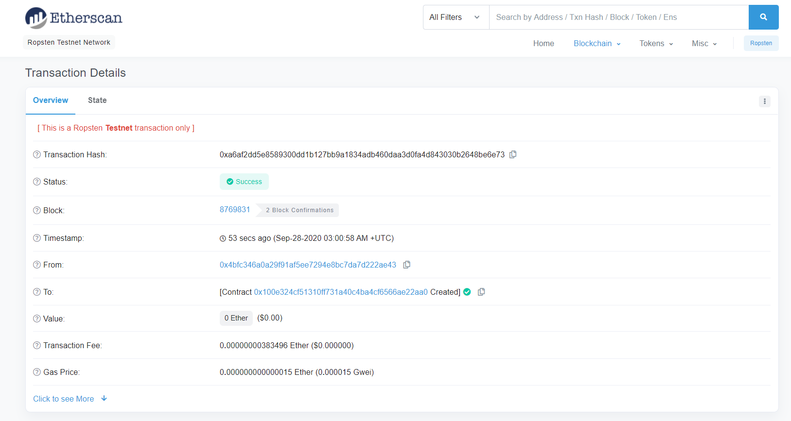
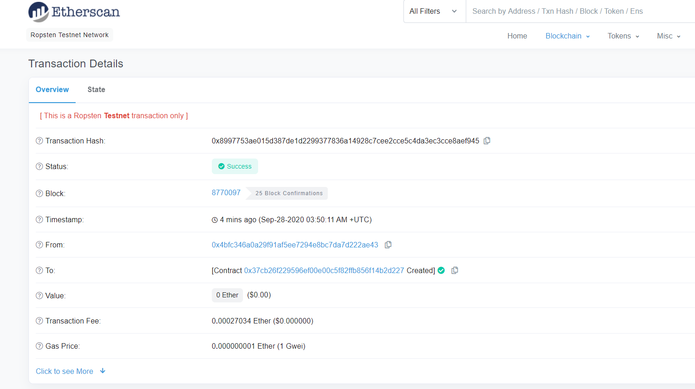
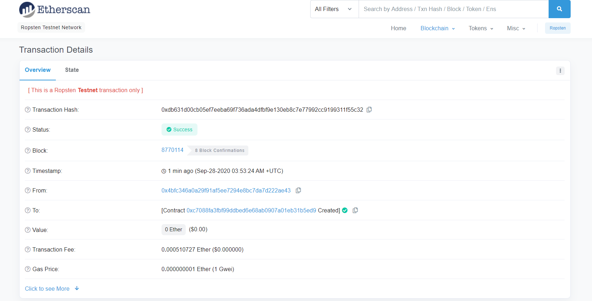

# Solidity_Homework

## Associate Profit Splitter

This will accept Ether into the contract and divide the Ether evenly among the associate level employees. This will allow the Human Resources department to pay employees quickly and efficiently.

Deployment Information:

## Tiered Profit Splitter

This will distribute different percentages of incoming Ether to employees at different tiers/levels. For example, the CEO gets paid 60%, CTO 25%, and Bob gets 15%.

Deployment Information: 

## Deferred Equity Plan

This will will automatically manage 1000 shares with an annual distribution of 250 over 4 years for a single employee.

Deployment Information:

